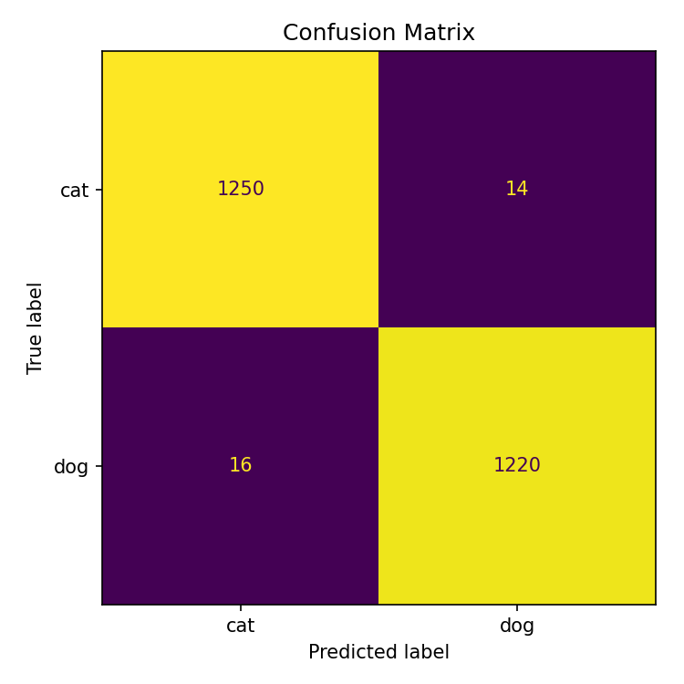
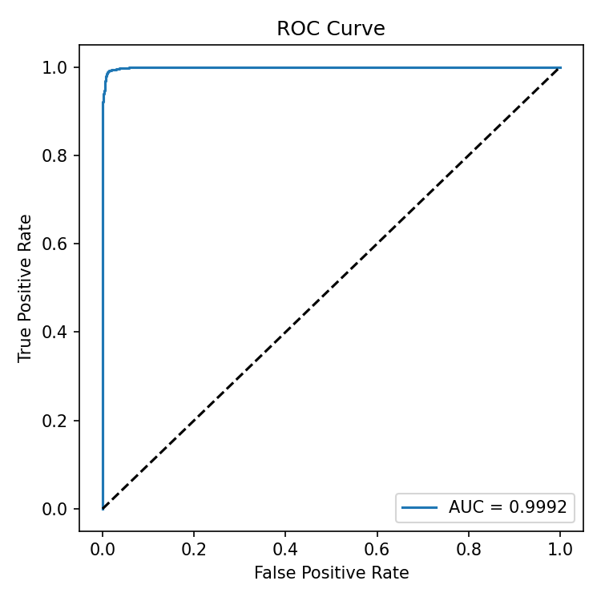

# Cats vs Dogs Classification

Binary image classifier (cat / dog) built with PyTorch and EfficientNet-B0.

## Model

- **Backbone**: EfficientNet-B0 (pretrained on ImageNet, fine-tuned)
- **Improvement 1**: Data augmentation — RandomHorizontalFlip, ColorJitter, RandomRotation
- **Improvement 2**: CosineAnnealingLR scheduler + early stopping (patience=5)

## Project Structure

```
cats-vs-dogs/
├── config.yaml                  # All hyperparameters and paths
├── train.py                     # Training entry point
├── evaluate.py                  # Evaluation entry point
├── requirements.txt
├── cats_vs_dogs_colab.ipynb     # End-to-end Colab notebook
└── src/
    ├── dataset.py               # Dataset, transforms, train/val split
    ├── model.py                 # Model definition, checkpoint I/O
    └── trainer.py               # Training loop, validation, early stopping
```

## Setup

```bash
pip install -r requirements.txt
```

## Data Preparation

1. Download `dogs-vs-cats.zip` from https://www.kaggle.com/competitions/dogs-vs-cats/data
2. Unzip and place the training images under `raw/train/`:

```
raw/train/
├── cat.0.jpg
├── cat.1.jpg
├── dog.0.jpg
└── ...
```

3. Update `raw_dir` in `config.yaml` to point to your image folder.

> **`work_dir` (Colab only)**  
> Google Drive I/O is slow. On Colab, set `work_dir` to a local path (e.g. `/content/cats-vs-dogs-data`) and the training script will copy the dataset there automatically before training.  
> When running locally, set `work_dir` to the same value as `raw_dir` (or leave it identical) to skip the copy.

## Train

```bash
python train.py --config config.yaml
```

- Saves the best checkpoint to `outputs/best.pth`
- Prints `train_loss / val_loss / val_acc` every epoch

## Evaluate

```bash
python evaluate.py --config config.yaml --checkpoint outputs/best.pth
```

Outputs:
- Accuracy / Precision / Recall / AUC-ROC printed to terminal
- `outputs/confusion_matrix.png`
- `outputs/roc_curve.png`

## Google Colab

Open `cats_vs_dogs_colab.ipynb` in Colab and run all cells top-to-bottom.

Steps in the notebook:
1. Mount Google Drive
2. Clone this repo
3. Install dependencies
4. Unzip dataset from Drive (upload `dogs-vs-cats.zip` to Drive first)
5. Verify GPU
6. Train
7. Evaluate
8. Display confusion matrix and ROC curve inline

## Results

| Metric    | Value  |
|-----------|--------|
| Accuracy  | 0.9880 |
| Precision | 0.9887 |
| Recall    | 0.9871 |
| AUC-ROC   | 0.9992 |



